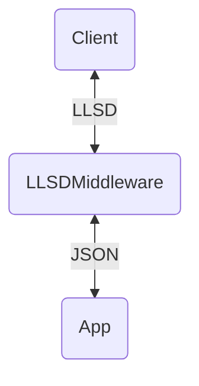

# llsd-asgi

`llsd-asgi` adds automatic [LLSD][] content negotiation to ASGI applications
(Starlette, FastAPI, Quart, etc.) with a single line of code:

```python
app.add_middleware(LLSDMiddleware)
```

The code for `llsd-asgi` is based on [msgpack-asgi][], a similar middleware
library for the [MessagePack][] binary format.

## Installation

Install with pip:

```
pip install llsd-asgi
```

## Quickstart (FastAPI)

You can use `llsd-asgi` with [FastAPI][] like so:

```python
from fastapi import FastAPI
from llsd_asgi import LLSDMiddleware

app = FastAPI()
app.add_middleware(LLSDMiddleware)
```

## Quickstart (Starlette)

As a lower level example using [Starlette][]:

```python
from llsd_asgi import LLSDMiddleware
from starlette.applications import Starlette
from starlette.responses import JSONResponse
from starlette.routing import Route


async def homepage(request):
    return JSONResponse({"hello": "world"})


app = Starlette(debug=True, routes=[
    Route('/', homepage),
])

# Wrap your application with the LLSD middleware
app = LLSDMiddleware(app)
```

## How it works



Your ASGI application is wrapped around the `LLSDMiddleware`, which performs
content negotiation based on `Content-Type` and `Accept` HTTP headers.

[FastAPI]: https://fastapi.tiangolo.com/
[LLSD]: https://wiki.secondlife.com/wiki/LLSD
[MessagePack]: https://msgpack.org/index.html
[Starlette]: https://www.starlette.io/
[msgpack-asgi]: https://github.com/florimondmanca/msgpack-asgi
